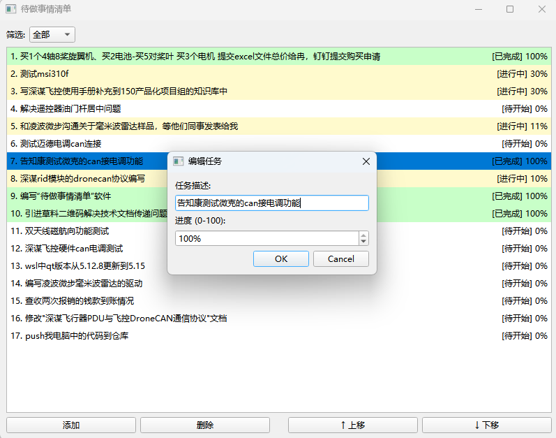

# TodoList

一个简单的待办事项管理应用。

## 功能特性

- 添加、编辑和删除待办事项
- 标记任务完成状态
- 简洁的用户界面

## 项目结构

```
TodoList/
├── index.html          # 主页面
├── style.css           # 样式文件
├── script.js           # 脚本文件
├── package.json        # 项目配置
└── README.md           # 项目说明
```

## 快速开始

### 安装依赖

```bash
npm install
```

### 运行项目

在浏览器中打开 `index.html` 文件，或使用本地服务器：

```bash
npm start
```

## 使用说明

1. 在输入框中输入待办事项
2. 点击"添加"按钮或按 Enter 键添加任务
3. 点击任务前的复选框标记完成状态
4. 点击删除按钮移除任务

## 应用截图



## 技术栈

- HTML5
- CSS3
- JavaScript (Vanilla)

## 许可证

MIT
